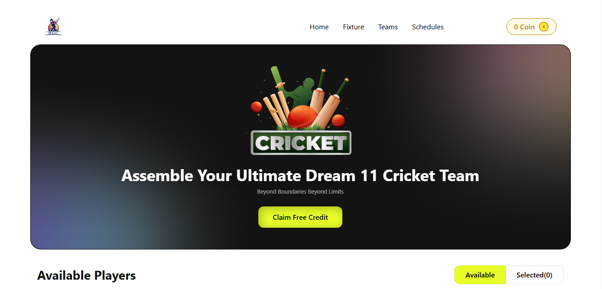

# 🏏 BPL-DREAM 11

[](https://bpldrem11.netlify.app/)


BPL-DREAM 11 is a responsive cricket team selection platform built with React, Vite, and Tailwind CSS. It allows users to create their dream cricket team by selecting players within a coin-based budget. This project was developed as part of the Programming Hero Web Development Course.

---

## 🌐 Live Demo

🔗 **[Live Preview](https://bpldrem11.netlify.app/)**

---

## 📸 Screenshot



---

## 📖 About

BPL-DREAM 11 is a single-page web application that simulates a fantasy cricket team selection experience. Users can browse available players, manage their coin balance, and build their team. The platform features a clean, user-friendly interface and is fully responsive for all devices.

---

## ✨ Features

- **Player Selection:** Choose players while managing a coin-based budget.
- **Dynamic Team Management:** Add or remove players with real-time updates.
- **Interactive Player Cards:** View player details such as ratings, roles, and pricing.
- **Dual View Modes:** Toggle between available players and selected team views.
- **Persistent Data:** Coin balance is saved using local storage.
- **Responsive Design:** Optimized for mobile, tablet, and desktop devices.
- **Modern Tech Stack:** Built with React, Vite, and Tailwind CSS for fast and efficient development.

---

## 🛠️ Technologies

| Technology       | Purpose                                      |
| ---------------- | -------------------------------------------- |
| **React**        | Component-based UI development.              |
| **Vite**         | Fast development environment and build tool. |
| **Tailwind CSS** | Utility-first CSS framework for styling.     |
| **JavaScript**   | Application logic and interactivity.         |
| **ESLint**       | Code linting for maintaining code quality.   |
| **Vercel**       | Hosting and continuous deployment.           |

---

## 📂 Project Structure

```
B10-Assignment-7/
├── public/
│   └── vite.svg
├── src/
│   ├── assets/
│   │   ├── banner-main.png
│   │   ├── bg-shadow.png
│   │   ├── logo-footer.png
│   │   ├── logo.png
│   │   └── site-Screenshot.png
│   ├── components/
│   │   ├── FancyAlert.jsx
│   │   ├── Footer.jsx
│   │   ├── Hero.jsx
│   │   ├── Navbar.jsx
│   │   ├── Newsletter.jsx
│   │   └── Players.jsx
│   ├── App.css
│   ├── App.jsx
│   ├── index.css
│   └── main.jsx
├── .gitignore
├── eslint.config.js
├── index.html
├── package.json
├── postcss.config.js
├── tailwind.config.js
├── vite.config.js
└── README.md
```

---

## 🚀 Getting Started

Follow these steps to run the project locally:

1. **Clone the repository:**
   ```bash
   git clone https://github.com/alaminkhanvvip/B10_Assignment-7.git
   ```
2. **Navigate to the project directory:**
   ```bash
   cd B10_Assignment-7
   ```
3. **Install dependencies:**
   ```bash
   npm install
   ```
4. **Start the development server:**
   ```bash
   npm run dev
   ```
5. **Open your browser** and visit `http://localhost:5173`.

---

## 🙏 Acknowledgements

Special thanks to the [Programming Hero](https://web.programming-hero.com/) team for their guidance and support throughout this project.
